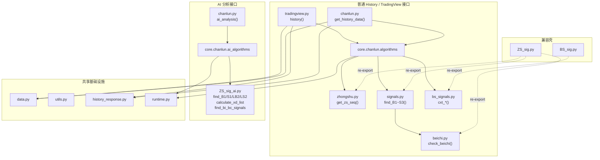

# 缠论核心模块重构深度分析报告

> **分析日期**: 2026-04-23  
> **基于 Commit**: `0dce0bb8` — *重构缠论核心模块并隔离AI分析逻辑*  
> **变更规模**: 21 files changed, 1,910 insertions(+), 2,128 deletions(−)

---

## 1. 重构动机与目标

> [!IMPORTANT]
> 本次重构解决了前一轮架构分析（conversation `b096ad8c`）中识别出的核心问题：
> - 算法逻辑散落在 `ZS_sig.py`（1,000+ 行）、`BS_sig.py`（300+ 行）、`chanlun.py`、`tradingview.py` 等大文件中
> - 普通接口与 AI 增强接口的算法路由混乱
> - MACD 参数反转 bug（已在 `beichi.py` 中修正为 `fast=12, slow=26, signal=9`）
> - `chanlun.py` 和 `tradingview.py` 各自维护一套重复的 response 组装逻辑

**重构目标**:
1. 按职责拆分到 `backend/core/chanlun/` 独立包
2. 普通接口与 AI 接口算法严格隔离
3. 旧 import 路径通过兼容壳保持不断

---

## 2. 新模块目录结构

```
backend/core/chanlun/
├── __init__.py           (7 行)    # 包入口说明
├── README.md             (242 行)  # 模块文档
├── runtime.py            (19 行)   # czsc 运行时初始化
├── utils.py              (147 行)  # 通用工具函数
├── data.py               (115 行)  # 数据访问与 K 线清洗
├── zhongshu.py           (142 行)  # 中枢算法
├── beichi.py             (47 行)   # 背驰判断
├── signals.py            (239 行)  # 历史买卖点 (B1/B2/B3/S1/S2/S3)
├── bs_signals.py         (194 行)  # 信号式买卖点 (cxt_*_V260101)
├── algorithms.py         (60 行)   # 普通算法门面层
├── ai_algorithms.py      (39 行)   # AI 算法门面层
├── legacy_utils.py       (43 行)   # 兼容历史工具导出
├── history_response.py   (192 行)  # TradingView 返回结构构建器
└── regression_guard.py   (120 行)  # 轻量级回归护栏
                         ─────────
                         1,606 行（含 README）
```

---

## 3. 各模块职责详解

### 3.1 基础设施层

| 模块 | 职责 | 关键函数 |
|------|------|----------|
| [runtime.py](file:///Users/yolanda/Documents/WorkSpace工作区/量化交易/datadriver-fund-qtrade-python/backend/core/chanlun/runtime.py) | 统一注入本地 `czsc` 路径，设置 `CZSC_USE_PYTHON` | `setup_local_czsc()` |
| [utils.py](file:///Users/yolanda/Documents/WorkSpace工作区/量化交易/datadriver-fund-qtrade-python/backend/core/chanlun/utils.py) | 时间转换、代码标准化、JSON 安全化、周期映射 | `dt_to_ts()`, `json_safe()`, `resolution_to_freq()` |
| [data.py](file:///Users/yolanda/Documents/WorkSpace工作区/量化交易/datadriver-fund-qtrade-python/backend/core/chanlun/data.py) | 数据库连接、K 线读取与清洗、聚合 | `read_stock_kline()`, `clean_kline_df()`, `aggregate_daily_kline()` |
| [legacy_utils.py](file:///Users/yolanda/Documents/WorkSpace工作区/量化交易/datadriver-fund-qtrade-python/backend/core/chanlun/legacy_utils.py) | 统一导出 `czsc.utils.sig` 工具函数 | 12 个工具函数的 re-export |

### 3.2 核心算法层

| 模块 | 职责 | 关键函数 | 来源 |
|------|------|----------|------|
| [zhongshu.py](file:///Users/yolanda/Documents/WorkSpace工作区/量化交易/datadriver-fund-qtrade-python/backend/core/chanlun/zhongshu.py) | 中枢识别与趋势判断 | `get_zs_seq()`, `check_down_trend()`, `check_up_trend()`, `get_relevant_zss()`, `get_entry_BI()`, `get_next_zs()` | 原 `ZS_sig.py` |
| [beichi.py](file:///Users/yolanda/Documents/WorkSpace工作区/量化交易/datadriver-fund-qtrade-python/backend/core/chanlun/beichi.py) | MACD 面积背驰判断 | `check_beichi()` | 原 `ZS_sig.py` |
| [signals.py](file:///Users/yolanda/Documents/WorkSpace工作区/量化交易/datadriver-fund-qtrade-python/backend/core/chanlun/signals.py) | 历史买卖点识别 | `find_B1()` ~ `find_B3()`, `find_S1()` ~ `find_S3()` | 原 `ZS_sig.py` |
| [bs_signals.py](file:///Users/yolanda/Documents/WorkSpace工作区/量化交易/datadriver-fund-qtrade-python/backend/core/chanlun/bs_signals.py) | 信号式当前买卖点判断 | `cxt_first_buy_V260101()`, `cxt_first_sell_V260101()`, `cxt_second_bs_V260101()`, `cxt_third_bs_V260101()` | 原 `BS_sig.py` |

### 3.3 门面与输出层

| 模块 | 职责 |
|------|------|
| [algorithms.py](file:///Users/yolanda/Documents/WorkSpace工作区/量化交易/datadriver-fund-qtrade-python/backend/core/chanlun/algorithms.py) | **普通接口**门面——组合 `zhongshu` + `signals` + `bs_signals`，提供 `calculate_main_bs_points()` |
| [ai_algorithms.py](file:///Users/yolanda/Documents/WorkSpace工作区/量化交易/datadriver-fund-qtrade-python/backend/core/chanlun/ai_algorithms.py) | **AI 接口**门面——桥接 `ZS_sig_ai.py` 的增强算法 |
| [history_response.py](file:///Users/yolanda/Documents/WorkSpace工作区/量化交易/datadriver-fund-qtrade-python/backend/core/chanlun/history_response.py) | TradingView history payload 统一构建器 |
| [regression_guard.py](file:///Users/yolanda/Documents/WorkSpace工作区/量化交易/datadriver-fund-qtrade-python/backend/core/chanlun/regression_guard.py) | 回归护栏——校验返回结构 + 算法来源不串线 |

---

## 4. 算法路由双轨隔离



> [!NOTE]
> **关键隔离点**: `algorithms.py` 的 `get_zs_seq` 来源于 `core.chanlun.zhongshu`，而 `ai_algorithms.py` 的 `get_zs_seq` 来源于 `ZS_sig_ai`。回归护栏 `regression_guard.py` 在运行时通过 `__module__` 属性验证这一点。

---

## 5. 代码量迁移对比

### 5.1 瘦身效果

| 文件 | 重构前（估算） | 重构后 | 变化 |
|------|---------------|--------|------|
| `ZS_sig.py` | ~1,080 行 | 64 行 | **−94%** (变为兼容壳) |
| `BS_sig.py` | ~320 行 | 18 行 | **−94%** (变为兼容壳) |
| `chanlun.py` | ~1,390 行 | 664 行 | **−52%** |
| `tradingview.py` | ~580 行 | 368 行 | **−37%** |
| **总计旧文件** | ~3,370 行 | 1,114 行 | **−67%** |

### 5.2 新增代码

| 位置 | 行数 |
|------|------|
| `core/chanlun/*.py` (不含 README) | 1,364 行 |
| `core/chanlun/README.md` | 242 行 |
| **新增总计** | 1,606 行 |

### 5.3 净变化

- 旧文件减少: ~2,256 行
- 新文件增加: ~1,606 行
- **净减少: ~650 行** (含大量冗余代码清除)

---

## 6. 兼容性壳设计

### `ZS_sig.py` (64 行)

```python
# 现在是纯 re-export 层
from core.chanlun.zhongshu import get_zs_seq, check_down_trend, check_up_trend, ...
from core.chanlun.signals import find_B1, find_B2, find_B3, find_S1, find_S2, find_S3
from core.chanlun.beichi import check_beichi
from core.chanlun.legacy_utils import cal_cross_num, check_cross_info, ...
```

### `BS_sig.py` (18 行)

```python
# 现在是纯 re-export 层
from core.chanlun.bs_signals import cxt_first_buy_V260101, cxt_first_sell_V260101, ...
```

> [!TIP]
> 旧的 `from ZS_sig import get_zs_seq` 等写法在外部项目中仍然可用，迁移完全向后兼容。

---

## 7. 数据流路径

### 7.1 普通 History 接口

```
请求参数 (symbol, resolution, from, to, countback)
    │
    ▼
normalize_ts_code() ──► get_ts_freq() ──► create_stock_kline_engine()
    │
    ▼
read_stock_kline() ──► clean_kline_df()
    │                      │
    │                      ▼ (如果季线/年线无数据)
    │                  aggregate_daily_kline()
    │
    ▼
czsc.format_standard_kline() ──► czsc.CZSC()
    │
    ├──► get_zs_seq(c.bi_list)           [zhongshu.py]
    │
    ├──► calculate_main_bs_points(c, zs) [algorithms.py]
    │       ├── find_B1 ─► check_beichi  [signals.py → beichi.py]
    │       ├── find_B2                  [signals.py]
    │       ├── find_B3                  [signals.py]
    │       ├── find_S1 ─► check_beichi  [signals.py → beichi.py]
    │       ├── find_S2                  [signals.py]
    │       └── find_S3                  [signals.py]
    │
    ▼
build_history_payload()                  [history_response.py]
    │
    ▼
TradingView JSON 响应
```

### 7.2 AI 分析接口

```
请求参数 (symbol, resolution)
    │
    ▼
get_analysis_data()
    ├── ai_get_zs_seq()                  [ZS_sig_ai.py via ai_algorithms.py]
    ├── ai_find_B1/B2/B3/LB2/S1/S2/S3/LS2  [ZS_sig_ai.py - 增强版本]
    ├── ai_find_bi_bc_signals()          [ZS_sig_ai.py - 高周期专用]
    └── ai_calculate_xd_list()           [ZS_sig_ai.py - 线段计算]
    │
    ▼
AIService.analyze_chanlun()              [AI 推理]
    │
    ▼
AIAnalysisHistory.objects.create()       [持久化]
```

---

## 8. 两个数据源对比

| 维度 | `chanlun.py` 普通接口 | `tradingview.py` 普通接口 |
|------|----------------------|--------------------------|
| **数据来源** | PostgreSQL `stock_kline` 表（via `data.py`） | Django ORM `DailyMarket` 表 |
| **清洗** | `clean_kline_df()` ✅ | `clean_kline_df()` ✅ |
| **聚合** | `aggregate_daily_kline()` | `aggregate_kline_by_rule()` |
| **中枢算法** | `core.chanlun.algorithms.get_zs_seq` | `core.chanlun.algorithms.get_zs_seq` |
| **买卖点** | `calculate_main_bs_points()` | `calculate_main_bs_points()` |
| **输出构建** | `build_history_payload()` | `build_history_payload()` |
| **性能埋点** | ✅ 有 `_perf` 字段 | ❌ 无 |

> [!WARNING]
> **双数据源问题仍然存在**: `chanlun.py` 走 `stock_kline`（via SQLAlchemy），`tradingview.py` 走 `DailyMarket`（via Django ORM）。虽然算法层已统一，但同一支股票在两个接口可能因数据源差异产生不同结果。

---

## 9. 回归护栏机制

[regression_guard.py](file:///Users/yolanda/Documents/WorkSpace工作区/量化交易/datadriver-fund-qtrade-python/backend/core/chanlun/regression_guard.py) 提供两层保护:

### 9.1 算法来源校验

```python
# 确保普通接口和 AI 接口没有串线
assert get_zs_seq.__module__ == "core.chanlun.zhongshu"      # 普通
assert ai_get_zs_seq.__module__ == "ZS_sig_ai"               # AI
```

### 9.2 返回结构校验

- 检查 17 个必需字段存在
- 验证 K 线数组长度一致 (`t/o/h/l/c/v`)
- 验证 `bis`, `bi_zss`, `mmds` 等为 list 类型
- 验证 `_perf.bs_calc_ms` 存在

**运行方式**: `python -m core.chanlun.regression_guard`

---

## 10. 发现的潜在问题与改进建议

### 🔴 高优先级

| # | 问题 | 位置 | 建议 |
|---|------|------|------|
| 1 | **`utils.py` L145 `resolution_to_freq` 存在歧义**: `"1M"` 既映射到 `Freq.F1`（分钟）又在 L146 返回 `Freq.M`（月线），后者永远覆盖前者 | [utils.py:120-147](file:///Users/yolanda/Documents/WorkSpace工作区/量化交易/datadriver-fund-qtrade-python/backend/core/chanlun/utils.py#L120-L147) | mapping 中去掉 `"1M": Freq.F1`，仅保留 L145-146 的特殊处理 |
| 2 | **双数据源未统一**: `chanlun.py` 用 `stock_kline`，`tradingview.py` 用 `DailyMarket`，同股不同数据 | `data.py` vs `tradingview.py` | 后续应统一到 `data.py` 的数据访问层 |
| 3 | **`ZS_sig_ai.py` (1,359 行) 未纳入重构**: AI 算法仍是一个巨型文件 | `ZS_sig_ai.py` | 按类似模式拆分到 `core/chanlun/ai/` 子包 |

### 🟡 中优先级

| # | 问题 | 位置 | 建议 |
|---|------|------|------|
| 4 | **`runtime.py` 在模块级重复调用**: 多个文件在 import 时执行 `setup_local_czsc()`，虽有幂等保护但造成理解负担 | 各 `*.py` 顶部 | 考虑在包 `__init__.py` 中统一初始化一次 |
| 5 | **`bs_signals.py` 中 `setup_local_czsc()` 在 import 之后调用** (L17)，与其他文件不一致（其他文件都在 import 之前调用） | [bs_signals.py:14-17](file:///Users/yolanda/Documents/WorkSpace工作区/量化交易/datadriver-fund-qtrade-python/backend/core/chanlun/bs_signals.py#L14-L17) | 调整到 import 前确保一致性 |
| 6 | **`tradingview.py` L18-19 仍直接做 `sys.path.insert` + 设置环境变量**，没有用 `runtime.py` | [tradingview.py:18-19](file:///Users/yolanda/Documents/WorkSpace工作区/量化交易/datadriver-fund-qtrade-python/backend/dvadmin/selection/views/tradingview.py#L18-L19) | 改为 `from core.chanlun.runtime import setup_local_czsc; setup_local_czsc()` |
| 7 | **回归护栏 `REQUIRED_KEYS` 包含 `_perf`**，但 `tradingview.py` 的 history 输出不含 `_perf` | [regression_guard.py:28-49](file:///Users/yolanda/Documents/WorkSpace工作区/量化交易/datadriver-fund-qtrade-python/backend/core/chanlun/regression_guard.py#L28-L49) | 区分两个接口的必需字段集，或为 `tradingview.py` 也补上 `_perf` |

### 🟢 低优先级

| # | 问题 | 建议 |
|---|------|------|
| 8 | `algorithms.py` 的 `__all__` 导出了 `cxt_*` 函数但从未在普通 history 流程中使用 | 考虑是否需要从门面层导出 |
| 9 | `chanlun.py` 中的 AI 分析相关代码（`ai_analysis`, `ai_history`, `ai_history_delete`）与普通 history 共存于同一 ViewSet | 后续可拆分为独立 ViewSet |
| 10 | `history_response.py` 中 `mmds` 的 `text` 字段拼接 `笔:B1` 等前缀，与 AI 接口的标记翻译（`一买`/`二买`）风格不统一 | 统一标记文本风格 |

---

## 11. 依赖关系矩阵

| 模块 | 依赖 `runtime` | 依赖 `utils` | 依赖 `czsc` | 依赖其他 `core.chanlun` |
|------|:-:|:-:|:-:|:--|
| `zhongshu.py` | ✅ | ❌ | ✅ | — |
| `beichi.py` | ✅ | ❌ | ✅ | — |
| `signals.py` | ✅ | ❌ | ✅ | `beichi`, `zhongshu` |
| `bs_signals.py` | ✅ | ❌ | ✅ | `zhongshu` |
| `algorithms.py` | ✅ | ❌ | ❌ | `signals`, `bs_signals`, `zhongshu` |
| `ai_algorithms.py` | ✅ | ❌ | ❌ | `ZS_sig_ai.py`（外部） |
| `data.py` | ❌ | ❌ | ❌ | — |
| `utils.py` | ❌ | ❌ | ❌ | `tushare2postgresql` |
| `history_response.py` | ❌ | ✅ | ❌ | — |
| `legacy_utils.py` | ✅ | ❌ | ✅ | — |
| `regression_guard.py` | ❌ | ✅ | ❌ | `algorithms`, `ai_algorithms` |

---

## 12. 总结

本次重构成功实现了：

1. **✅ 职责分离**: 从 4 个大文件中提取出 14 个独立模块，每个模块职责清晰
2. **✅ 算法隔离**: 普通接口和 AI 接口通过独立的门面层 (`algorithms.py` / `ai_algorithms.py`) 严格分离
3. **✅ 向后兼容**: `ZS_sig.py` 和 `BS_sig.py` 保留为兼容壳，外部 import 不受影响
4. **✅ Bug 修复**: MACD 参数顺序已在 `beichi.py` 中修正
5. **✅ 代码消重**: `history_response.py` 统一了 `chanlun.py` 和 `tradingview.py` 的重复输出逻辑
6. **✅ 回归保护**: `regression_guard.py` 提供结构和来源的双重校验

**主要待解决事项**: 双数据源统一、`ZS_sig_ai.py` 继续拆分、`runtime.py` 初始化路径优化。

---

## 13. 深度补充分析：更多潜在问题与改进建议

> [!IMPORTANT]
> 以下是对代码逐行审查后发现的更深层次问题，按 **算法性能、数据库/资源、错误处理、数据完整性、安全性、一致性、测试** 7个维度分类。

### 13.1 🔴 算法性能问题

#### P1. `find_B1`/`find_S1` 存在 O(n³) 最坏复杂度

```
find_B1 遍历 bi_list (n)
  └─ 每个 bi 调用 get_relevant_zss (遍历 zs_list, ~n)
      └─ 满足条件时调用 check_beichi
          └─ check_beichi 内部 _bars_in_range 全量扫描 bars_raw (~n)
```

- **位置**: [signals.py:17-57](file:///Users/yolanda/Documents/WorkSpace工作区/量化交易/datadriver-fund-qtrade-python/backend/core/chanlun/signals.py#L17-L57) → [beichi.py:27-28](file:///Users/yolanda/Documents/WorkSpace工作区/量化交易/datadriver-fund-qtrade-python/backend/core/chanlun/beichi.py#L27-L28)
- **影响**: 当笔数量超过 200 时，计算时间可能显著增加
- **建议**: 
  - `_bars_in_range` 改用二分查找（`bisect`），因为 `bars_raw` 已按时间排序
  - `get_relevant_zss` 结果可按 bi 做增量缓存，避免重复过滤

#### P2. `find_B2`/`find_S2` 中线性查找 bi_index

```python
# signals.py L110-113: 每个 b1 都线性扫描 bi_list 找 index
for i, bi in enumerate(bi_list):
    if bi.edt == b1_dt:
        b1_bi_index = i
        break
```

- **建议**: 预构建 `{bi.edt: index}` 字典，将 O(n×m) 降为 O(n+m)

#### P3. `check_beichi` 每次调用都重新计算 MACD 缓存

```python
# beichi.py L25: 在 find_B1 循环内被多次调用
cache_key = update_macd_cache(czsc_obj, fastperiod=12, slowperiod=26, signalperiod=9)
```

- `update_macd_cache` 内部有缓存机制，但仍需遍历检查是否已缓存。在 `find_B1` 循环中被调用 n 次，应提前在外层调用一次并传入 `cache_key`

#### P4. `get_zs_seq` 在 `_find_next_zs_start` 返回 None 时静默丢弃剩余笔

```python
# zhongshu.py L64-65
start = _find_next_zs_start(i, pattern)
if start is None:
    break  # ← 后续所有笔被丢弃，不再处理
```

- **影响**: 如果某次中枢突破后找不到新的三笔重叠，后续所有笔不会被归入任何中枢
- **建议**: 考虑 `i += 1; continue` 跳过当前笔继续尝试，或至少记录日志

### 13.2 🔴 数据库与资源问题

#### P5. `create_stock_kline_engine()` 每次调用创建新的 SQLAlchemy Engine（无连接池复用）

```python
# data.py L15-21
def create_stock_kline_engine():
    return create_engine(f"postgresql://...")  # 每次都 new
```

- **问题**: `chanlun.py` 中 `get_analysis_data`(L75) 和 `get_history_data`(L334) 各自调用一次，每个请求创建 2 个独立的数据库连接池
- **影响**: 高并发下连接数爆炸
- **建议**: 改为模块级单例 `_engine = None` + lazy init，或使用 `@lru_cache`

#### P6. `aggregate_daily_kline` 聚合后丢失 `symbol` 列

```python
# data.py L77-84: agg_dict 中没有 symbol
agg_dict = {"open": "first", "high": "max", "low": "min", "close": "last", "vol": "sum", "amount": "sum"}
```

- 但 `aggregate_kline_by_rule`(L110-111) 有处理 symbol 的逻辑。两个聚合函数行为不一致
- **影响**: 聚合后的 DataFrame 传入 `clean_kline_df` 时，L44 `df["symbol"] = ts_code` 会重新赋值，所以暂不会报错，但语义上不一致

### 13.3 🔴 错误处理问题

#### P7. `perf["total_start"]` 在提前返回路径中泄漏到 JSON 响应

```python
# chanlun.py L359-361
if df.empty:
    perf["total_ms"] = (_time.perf_counter() - perf["total_start"]) * 1000
    return {"s": "no_data", "_perf": perf}  # ← perf 仍包含 total_start (float)
```

- L360 和 L367 两处提前返回都没有 `del perf["total_start"]`，而 L442、L452 正常路径有
- **影响**: 前端收到一个多余的 `total_start` 字段（perf_counter 的原始浮点数）

#### P8. `_format_ai_dt` 可能在 `_dt_to_str` 返回 None 时崩溃

```python
# chanlun.py L127-129
def _format_ai_dt(dt_val, f_enum):
    s_dt = _dt_to_str(dt_val)           # 可能返回 None
    if f_enum == Freq.D and " 00:00:00" in s_dt:  # ← TypeError: 'in' on None
```

- **建议**: 加 `if s_dt is None: return None` 前置判断

#### P9. 线段买卖点匹配存在除零风险

```python
# chanlun.py L220
if p_dt == seg_end_dt and abs(p_price - seg_end_val) / seg_end_val < 0.005:
#                                                      ^^^^^^^^^^^^ 可能为 0
```

- 当 `seg_end_val == 0` 时触发 `ZeroDivisionError`
- **建议**: 加 `seg_end_val != 0` 保护或使用绝对差值

### 13.4 🟡 数据完整性问题

#### P10. `build_history_payload` 的 `mmds` 未按时间范围过滤

```python
# history_response.py: bis(L116) 和 bi_zss(L134) 都检查了 t_min/t_max 范围
# 但 mmds(L149-158) 没有做范围过滤
for point in bs_points:
    ts = dt_to_ts(point.get("dt"), is_daily, freq)
    # 没有 if ts < t_min or ts > t_max: continue
    mmds.append(...)
```

- **影响**: 当使用 `from_ts`/`to_ts` 过滤 K 线后，mmds 可能包含不在当前视窗内的买卖点
- **建议**: 加 `if int(ts) < t_min or int(ts) > t_max: continue`

#### P11. `aggregate_daily_kline` 对非季线/年线的 freq 默认使用 "YS" 规则

```python
# data.py L76
rule = "QS" if getattr(freq_enum, "value", None) == "季线" else "YS"
```

- 如果传入非季线/年线的 freq（比如误传月线），会默认按年线聚合
- **建议**: 加参数校验或明确的 else 分支报错

#### P12. 普通接口与 AI 接口对同一股票可能产生不同中枢序列

普通接口用 `core.chanlun.zhongshu.get_zs_seq`，AI 接口用 `ZS_sig_ai.get_zs_seq`。两个实现的中枢构建逻辑可能有差异（如三笔重叠判断、中枢扩展规则）。同一支股票在 TradingView 图表和 AI 分析报告中显示的中枢可能不一致。

### 13.5 🟡 安全性问题

#### P13. 数据库凭证硬编码为默认值

```python
# data.py L16-20
db_host = os.getenv("DB_HOST", "192.168.1.207")
db_password = os.getenv("DB_PASSWORD", "datadriver")
```

- 生产环境如果忘记设置环境变量，会连接到开发环境数据库
- **建议**: 生产模式下不设默认值，缺失时直接报错

#### P14. AI 分析异常返回原始 Exception 信息

```python
# chanlun.py L585-586
return Response({"code": 5000, "msg": f"AI 分析执行异常: {str(e)}", "error": str(e)}, status=500)
```

- `str(e)` 可能包含数据库连接串、文件路径等敏感信息
- **建议**: 生产环境仅返回通用错误消息，详情写日志

### 13.6 🟡 一致性问题

#### P15. 运行时初始化路径不统一（3 种方式并存）

| 文件 | 初始化方式 |
|------|-----------|
| `core/chanlun/*.py` (7处) | `from .runtime import setup_local_czsc; setup_local_czsc()` |
| `chanlun.py` (view) | `from core.chanlun.runtime import setup_local_czsc; setup_local_czsc()` |
| `tradingview.py` (view) | 手动 `sys.path.insert` + `os.environ["CZSC_USE_PYTHON"] = "1"` |
| `main.py` | 手动 `os.environ["CZSC_USE_PYTHON"] = "1"` |

- `tradingview.py` 和 `main.py` 仍使用旧方式，与重构目标矛盾

#### P16. `perf` 中 `b1_calc_ms` ~ `s3_calc_ms` 字段始终为 0

```python
# chanlun.py L405-410: 重构后用 calculate_main_bs_points 一次性计算
perf["b1_calc_ms"] = 0.0  # 永远是 0
perf["b2_calc_ms"] = 0.0  # 永远是 0
...
```

- 这些字段在重构前各有独立计时，现在已失去意义
- **建议**: 要么删除这些字段，要么在 `calculate_main_bs_points` 内部分步计时

#### P17. `bs_signals.py` 中 `setup_local_czsc()` 在 czsc import 之后才调用

```python
# bs_signals.py L8-17
import numpy as np
from czsc import CZSC           # ← 先 import czsc
from czsc.core import BI, ZS, Direction
from czsc.signals.tas import update_ma_cache
from czsc.utils import create_single_signal, get_sub_elements

from .runtime import setup_local_czsc
from .zhongshu import get_zs_seq
setup_local_czsc()              # ← 后调用 setup
```

- 其他文件（如 `zhongshu.py`、`beichi.py`、`signals.py`）都是先 setup 后 import
- 如果 czsc 不在默认路径中，这里会 `ImportError`

### 13.7 🟢 测试与可维护性

#### P18. 核心算法模块完全没有单元测试

- `core/chanlun/` 下 14 个模块无任何 test 文件
- `regression_guard.py` 需要实时数据库连接才能运行，无法在 CI 环境使用
- **建议**: 为核心算法（`zhongshu`、`signals`、`beichi`）编写基于固定 mock 数据的单元测试

#### P19. 买卖点返回结构使用裸 `Dict` 而非类型化对象

```python
# signals.py: 所有 find_* 函数返回 List[Dict]
buy_points.append({
    "dt": current_bi.edt, "price": current_bi.low,
    "op": Operate.LO, "op_desc": "B1", "bs_type": "B1",
})
```

- 没有 `TypedDict` 或 `dataclass` 约束，key 拼写错误不会被检测到
- **建议**: 定义 `BSPoint(TypedDict)` 或 `@dataclass` 统一结构

#### P20. `chanlun.py` 中 `get_analysis_data` 函数仍有 280+ 行

虽然算法被提取到 `core/chanlun/`，但 `get_analysis_data`（L70-280）仍包含大量 AI 数据组装、线段保底逻辑、买卖点标记翻译等代码。这些可以进一步提取：
- 线段计算与保底 → `core/chanlun/xd_response.py`
- 买卖点标记翻译 → `core/chanlun/mark_translator.py`
- AI 数据组装 → `core/chanlun/ai_response.py`

---

## 14. 问题全景优先级矩阵

| 优先级 | 编号 | 类别 | 一句话概要 |
|:------:|:----:|:----:|-----------|
| 🔴 | P1 | 性能 | `find_B1/S1` O(n³) 复杂度，笔多时性能瓶颈 |
| 🔴 | P5 | 资源 | 每次请求创建新 SQLAlchemy Engine，无连接池复用 |
| 🔴 | P7 | 错误 | `perf["total_start"]` 在提前返回路径泄漏 |
| 🔴 | P8 | 错误 | `_format_ai_dt` 对 None 返回值未保护 |
| 🔴 | P9 | 错误 | 线段匹配除零风险 |
| 🟡 | P2 | 性能 | `find_B2/S2` 线性查找可优化 |
| 🟡 | P3 | 性能 | MACD 缓存在循环中重复调用 |
| 🟡 | P4 | 算法 | 中枢构建在找不到新中枢时丢弃剩余笔 |
| 🟡 | P10 | 完整性 | mmds 未按时间范围过滤 |
| 🟡 | P11 | 完整性 | 聚合函数对非预期 freq 静默降级 |
| 🟡 | P12 | 完整性 | 普通/AI 接口中枢算法可能不一致 |
| 🟡 | P13 | 安全 | 数据库凭证硬编码默认值 |
| 🟡 | P14 | 安全 | 异常返回原始错误信息 |
| 🟡 | P15 | 一致性 | 运行时初始化 3 种方式并存 |
| 🟡 | P16 | 一致性 | perf 分步计时字段失效 |
| 🟡 | P17 | 一致性 | bs_signals.py setup 调用顺序与其他文件不一致 |
| 🟢 | P6 | 完整性 | 两个聚合函数 symbol 列处理不一致 |
| 🟢 | P18 | 测试 | 核心算法无单元测试 |
| 🟢 | P19 | 类型 | 买卖点使用裸 Dict 无类型约束 |
| 🟢 | P20 | 架构 | `get_analysis_data` 仍有 280+ 行可继续拆分 |

---

## 15. 建议的下一步行动

1. **立即修复** (P7/P8/P9): 三个运行时错误风险，改动量小
2. **短期优化** (P5): Engine 单例化，防止连接泄漏
3. **中期重构** (P1/P15/P17): 算法性能优化 + 运行时初始化统一
4. **长期规划** (P18/P20): 补充单元测试 + `get_analysis_data` 继续拆分
